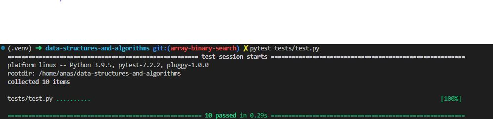

# Code Challenge: Class 03

Write out code as part of your whiteboard process.

Write a function called BinarySearch which takes in 2 parameters: a sorted array and the search key. Without utilizing any of the built-in methods available to your language, return the index of the array’s element that is equal to the value of the search key, or -1 if the element is not in the array.

## Whiteboard Process

## Approach & Efficiency

Loops, indexes, conditions.

Time complexity is O(log n), where n is the length of the input array. This is because the algorithm divides the search interval in half at each iteration, reducing the search space by a factor of 2 each time. As a result, the number of iterations required to find the target value grows logarithmically with the size of the input array.

Space complexity is O(1) because it uses a constant amount of additional space for the left, right, and mid-pointers. The input array is not modified, and no new data structures are created during the search.

## Solution

[Previous](../array_insert_shift/README.md)
