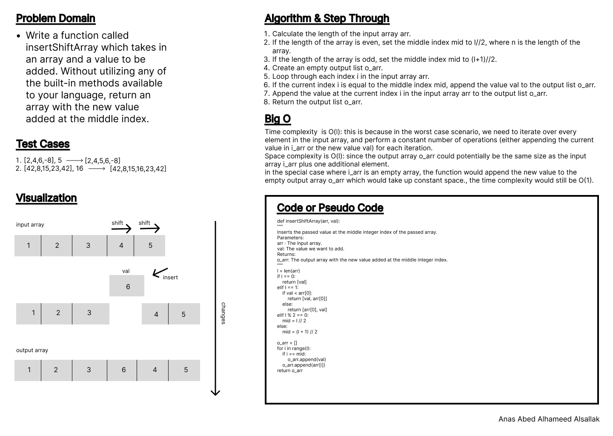
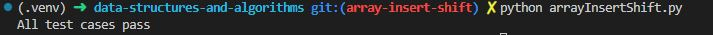

# Code Challenge: Class 02

Write out code as part of your whiteboard process.

Write a function called insertShiftArray which takes in an array and a value to be added. Without utilizing any of the built-in methods available to your language, return an array with the new value added at the middle index.

## Whiteboard Process

.

## Approach & Efficiency

Loops, indexes.

Time complexity is O(l): this is because in the worst case scenario, we need to iterate over every element in the input array, and perform a constant number of operations (either appending the current value in i_arr or the new value val) for each iteration.
Space complexity is O(n): since the output array o_arr could potentially be the same size as the input array i_arr plus one additional element.
In the special case where i_arr is an empty array, the function would append the new value to the empty output array o_arr which would take up constant space., the time complexity would still be O(1).

## Solution

.

[Previous](../array_reverse/README.md)
