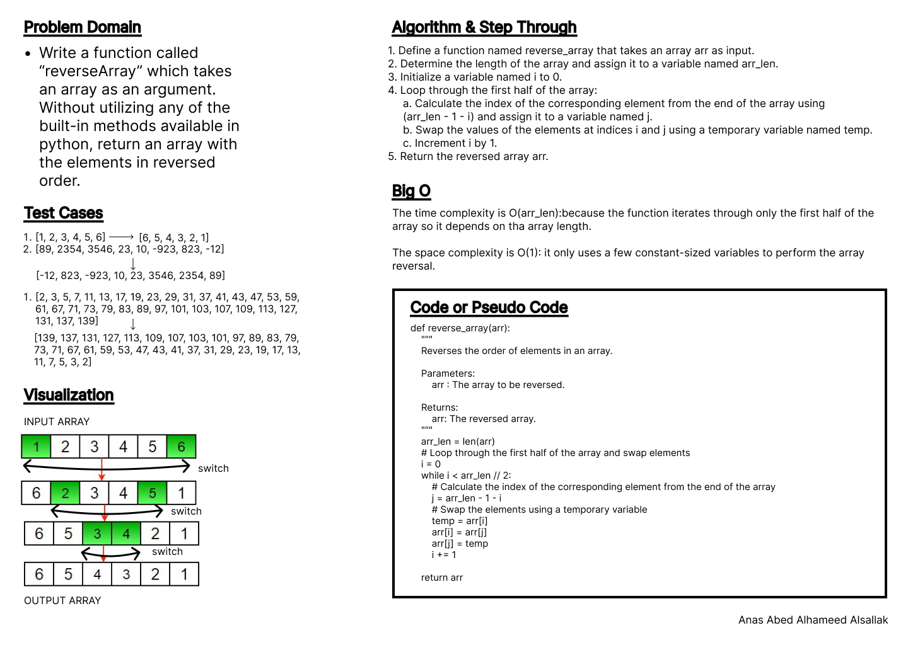

# Code Challenge: Class 01

Write out code as part of your whiteboard process.

Write a function called reverseArray which takes an array as an argument. Without utilizing any of the built-in methods available to your language, return an array with elements in reversed order.

## Whiteboard Process

.

## Approach & Efficiency

Loops, indexes.

The time complexity is O(arr_len):because the function iterates through only the first half of the array so it depends on the array length.

The space complexity is O(1): it only uses a few constant-sized variables to perform the array reversal.

## Solution

[Code](../arrayReverse.py)

[Tests](../tests/test.py)

.

[Move to CC 02](../array_insert_shift/README.md) | [Previous](../README.md)
