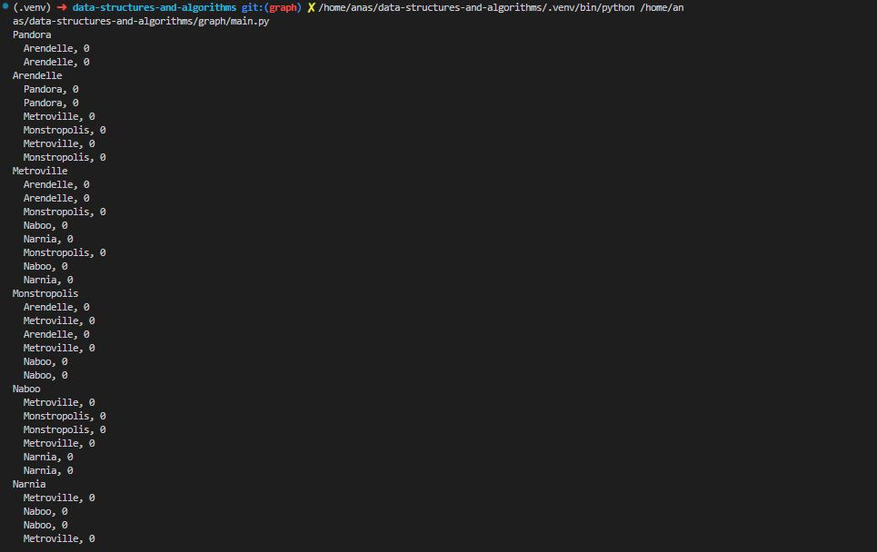
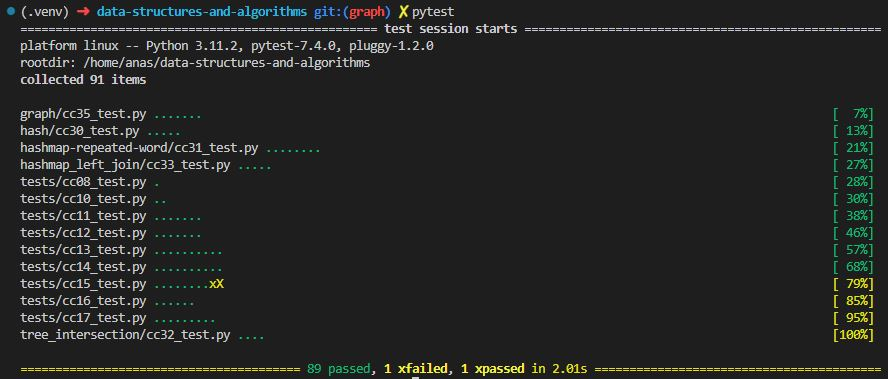

# Code Challenge 35: Implementation: graphs

Implement your own Graph. The graph should be represented as an adjacency list, and should include the following methods:

add vertex
    Arguments: value
    Returns: The added vertex
    Add a vertex to the graph
add edge
    Arguments: 2 vertices to be connected by the edge, weight (optional)
    Returns: nothing
    Adds a new edge between two vertices in the graph
    If specified, assign a weight to the edge
    Both vertices should already be in the Graph
get vertices
    Arguments: none
    Returns all of the vertices in the graph as a collection (set, list, or similar)
    Empty collection returned if there are no vertices
get neighbors
    Arguments: vertex
    Returns a collection of edges connected to the given vertex
    Include the weight of the connection in the returned collection
    Empty collection returned if there are no vertices
size
    Arguments: none
    Returns the total number of vertices in the graph
    0 if there are none

## Approach & Efficiency

Classes, loops, conditionals, bracket notation.

Let's analyze the time and space complexities of the various operations in the given graph implementation:

1. **Time Complexity:**

    - Adding a Vertex (`add_vertex`): The time complexity is O(1) as it involves adding a single node to the graph, which is a constant-time operation.

    - Adding an Edge (`add_edge`): The time complexity is also O(1). Adding an edge involves appending an element to the adjacency list of the source node, which is a constant-time operation.

    - Retrieving Neighbors (`get_neighbors`): The time complexity is O(1) on average for an undirected graph. Since the graph uses an adjacency list, finding neighbors of a vertex involves directly accessing its adjacency list, which is a constant-time operation on average.

    - Retrieving All Vertices (`get_vertices`): The time complexity is O(V), where V is the number of vertices in the graph. This is because all the vertices need to be retrieved from the adjacency list, and the number of vertices will affect the time taken.

    - Get Size (`size`): The time complexity is O(1). It involves returning the length of the adjacency list, which is a constant-time operation.

2. **Space Complexity:**

    - The space complexity for the `Graph` class is O(V + E), where V is the number of vertices and E is the number of edges. This is because each vertex is stored in the adjacency list, and for each vertex, we store its outgoing edges in the adjacency list.

    - Adding a Vertex (`add_vertex`): The space complexity is O(1) since adding a vertex involves creating a new node and adding it to the adjacency list.

    - Adding an Edge (`add_edge`): The space complexity is O(1) as it involves adding an edge object to the adjacency list of the source node.

    - Retrieving Neighbors (`get_neighbors`): The space complexity is O(E), where E is the number of edges for the given vertex. This is because the method returns the adjacency list of the vertex, which contains all its outgoing edges.

The graph implementation has an efficient time and space complexity, especially for adding vertices and edges and retrieving neighbors. The space complexity is mostly determined by the number of vertices and edges in the graph.

## Solution

test:

