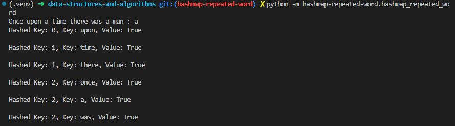
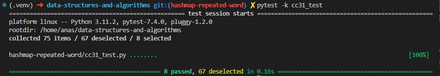

# Code Challenge 31

Write a function called repeated word that finds the first word to occur more than once in a string
Arguments: string
Return: string

## Whiteboard Process

## Approach & Efficiency

Classes, methods, loops, conditionals.

Time complexity: O(n) where n is the number of words in the book.
Space complexity: O(m) where m is the number of unique words in the book.

## Solution

test:

