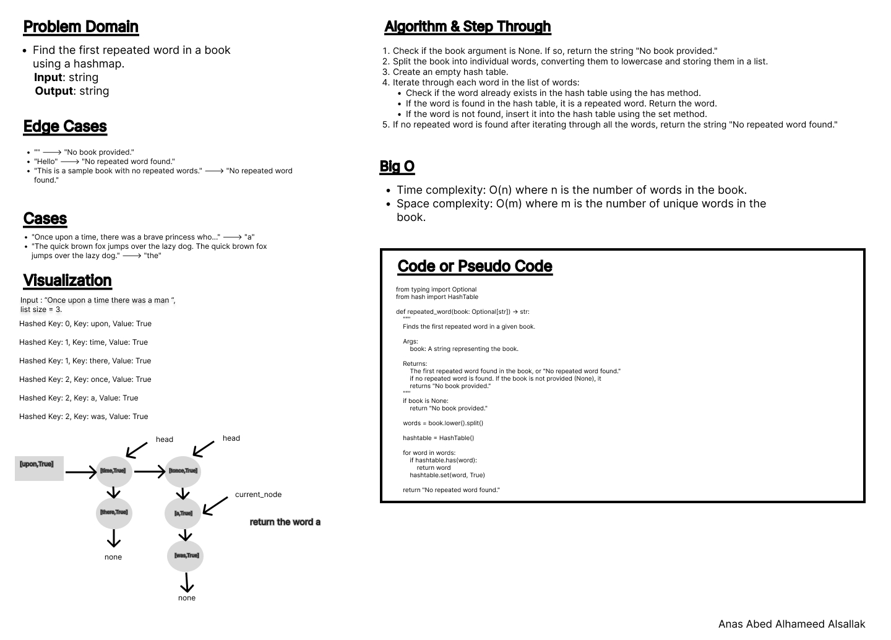

# Code Challenge 31

Write a function called repeated word that finds the first word to occur more than once in a string
Arguments: string
Return: string

## Whiteboard Process

## Approach & Efficiency

Classes, methods, recursion, conditionals.

In short-terms the function has a time complexity of O(n) and a space complexity of O(n), where n is the total number of nodes in both trees.

## Solution

