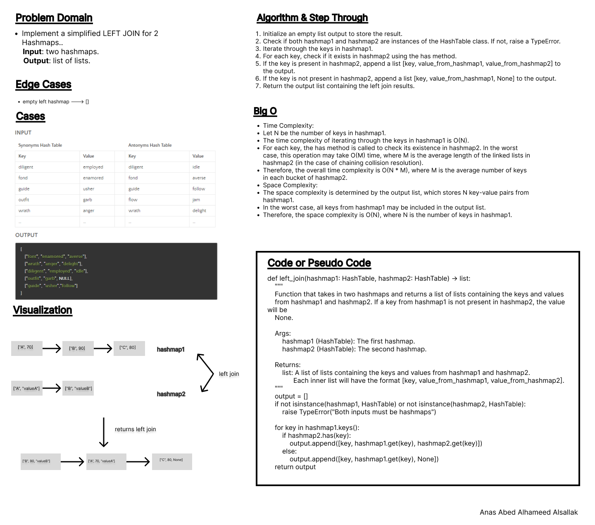

# Code Challenge 33

Implement a simplified LEFT JOIN for 2 Hashmaps.

## Whiteboard Process

## Approach & Efficiency

Classes, methods, loops, conditionals.

- Time Complexity:
- Let N be the number of keys in hashmap1.
- The time complexity of iterating through the keys in hashmap1 is O(N).
- For each key, the has method is called to check its existence in hashmap2. In the worst case, this operation may take O(M) time, where M is the average length of the linked lists in hashmap2 (in the case of chaining collision resolution).
- Therefore, the overall time complexity is O(N * M), where M is the average number of keys in each bucket of hashmap2.

- Space Complexity:
- The space complexity is determined by the output list, which stores N key-value pairs from hashmap1.
- In the worst case, all keys from hashmap1 may be included in the output list.
- Therefore, the space complexity is O(N), where N is the number of keys in hashmap1.

## Solution

[code](./hashmap_left_join_script.py)

[test](./cc33_test.py)
