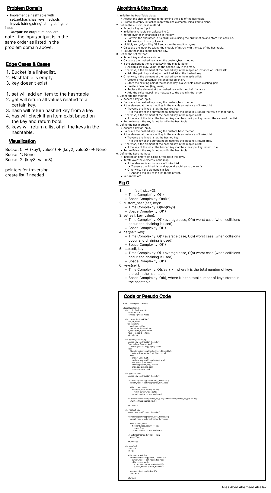
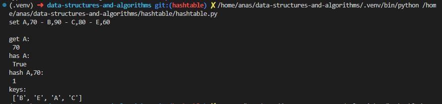
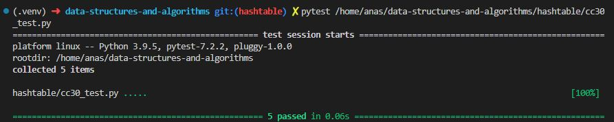

# Code Challenge 30: Implementation: Hash Tables

Implement a Hashtable Class with the following methods:

    set
        Arguments: key, value
        Returns: nothing
        This method should hash the key, and set the key and value pair in the table, handling collisions as needed.
        Should a given key already exist, replace its value from the value argument given to this method.
    get
        Arguments: key
        Returns: Value associated with that key in the table
    has
        Arguments: key
        Returns: Boolean, indicating if the key exists in the table already.
    keys
        Returns: Collection of keys
    hash
        Arguments: key
        Returns: Index in the collection for that key

## Whiteboard Process

## Approach & Efficiency

Classes, loops, conditionals, bracket notation.

1. `__init__(self, size=3)`:
   - Time Complexity: O(1)
   - Space Complexity: O(size)

2. `custom_hash(self, key)`:
   - Time Complexity: O(len(key))
   - Space Complexity: O(1)

3. `set(self, key, value)`:
   - Time Complexity: O(1) average case, O(n) worst case (when collisions occur and chaining is used)
   - Space Complexity: O(1)

4. `get(self, key)`:
   - Time Complexity: O(1) average case, O(n) worst case (when collisions occur and chaining is used)
   - Space Complexity: O(1)

5. `has(self, key)`:
   - Time Complexity: O(1) average case, O(n) worst case (when collisions occur and chaining is used)
   - Space Complexity: O(1)

6. `keys(self)`:
   - Time Complexity: O(size + k), where k is the total number of keys stored in the hashtable
   - Space Complexity: O(k), where k is the total number of keys stored in the hashtable

## Solution

test:

