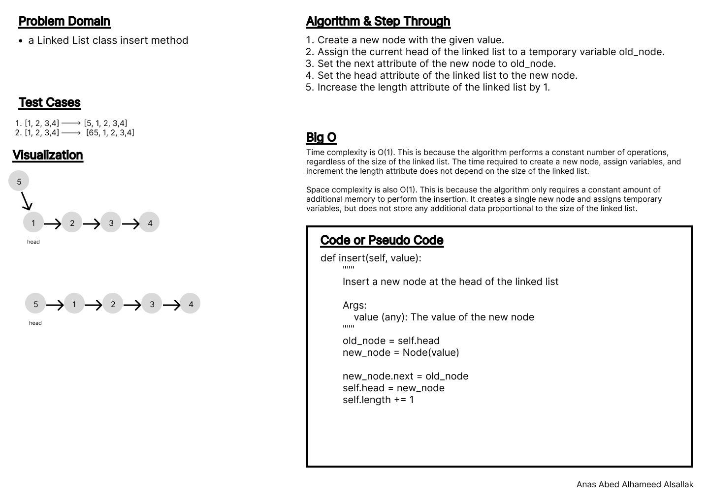
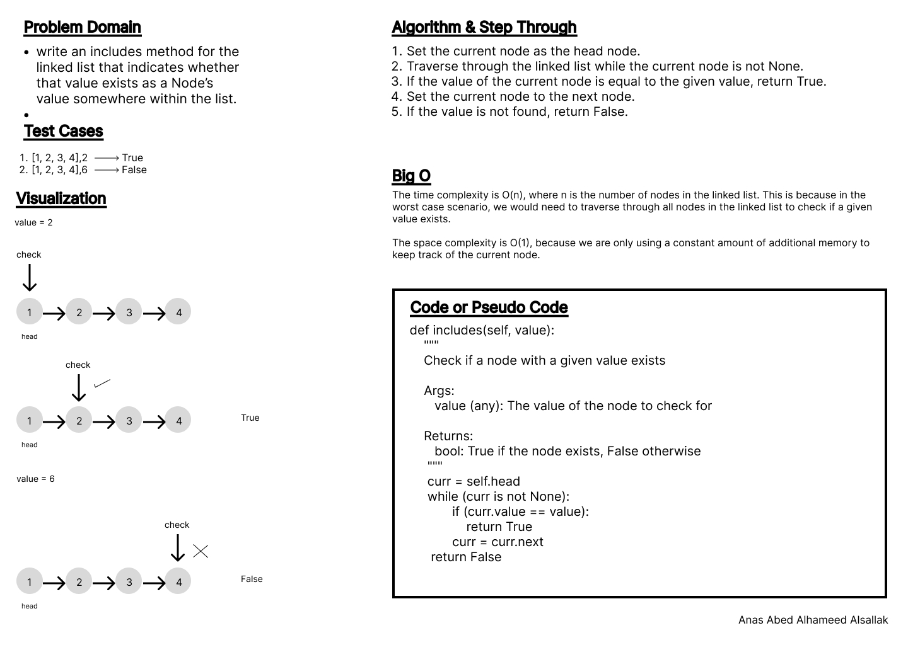
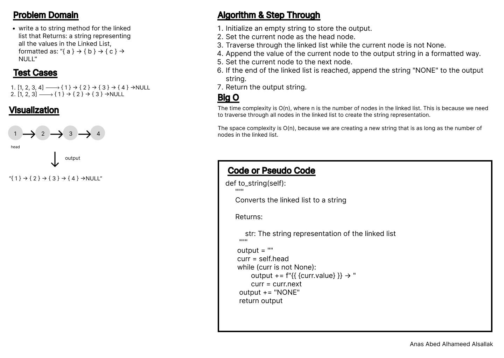
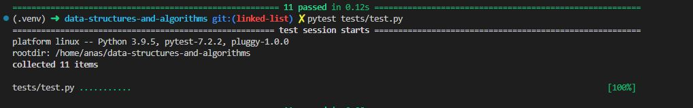

# Code Challenge: Class 05

Write out code as part of your whiteboard process.

Features

- Node
  - Create a Node class that has properties for the value stored in the Node, and a pointer to the next Node.
- Linked List
  - Create a Linked List class
  - Within your Linked List class, include a head property.
    - Upon instantiation, an empty Linked List should be created.
- The class should contain the following methods
  - insert
    - Arguments: value
    - Returns: nothing
      - Adds a new node with that value to the head of the list with an O(1) Time performance.
  - includes
    - Arguments: value
    - Returns: Boolean
            -Indicates whether that value exists as a Node’s value somewhere within the list.
  - to string
    - Arguments: none
    - Returns: a string representing all the values in the Linked List, formatted as:
        "{ a } -> { b } -> { c } -> NULL"

## Whiteboard Process

### insert

### includes

### to string

## Approach & Efficiency

Loops, indexes, conditions, interpolation.

1

Time complexity is O(1). This is because the algorithm performs a constant number of operations, regardless of the size of the linked list. The time required to create a new node, assign variables, and increment the length attribute does not depend on the size of the linked list.

Space complexity is also O(1). This is because the algorithm only requires a constant amount of additional memory to perform the insertion. It creates a single new node and assigns temporary variables, but does not store any additional data proportional to the size of the linked list.

2

The time complexity is O(n), where n is the number of nodes in the linked list. This is because in the worst case scenario, we would need to traverse through all nodes in the linked list to check if a given value exists.

The space complexity is O(1), because we are only using a constant amount of additional memory to keep track of the current node.

3

The time complexity is O(n), where n is the number of nodes in the linked list. This is because we need to traverse through all nodes in the linked list to create the string representation.

The space complexity is O(n), because we are creating a new string that is as long as the number of nodes in the linked list.

## Solution

[Previous](../array_insert_shift/README.md)
