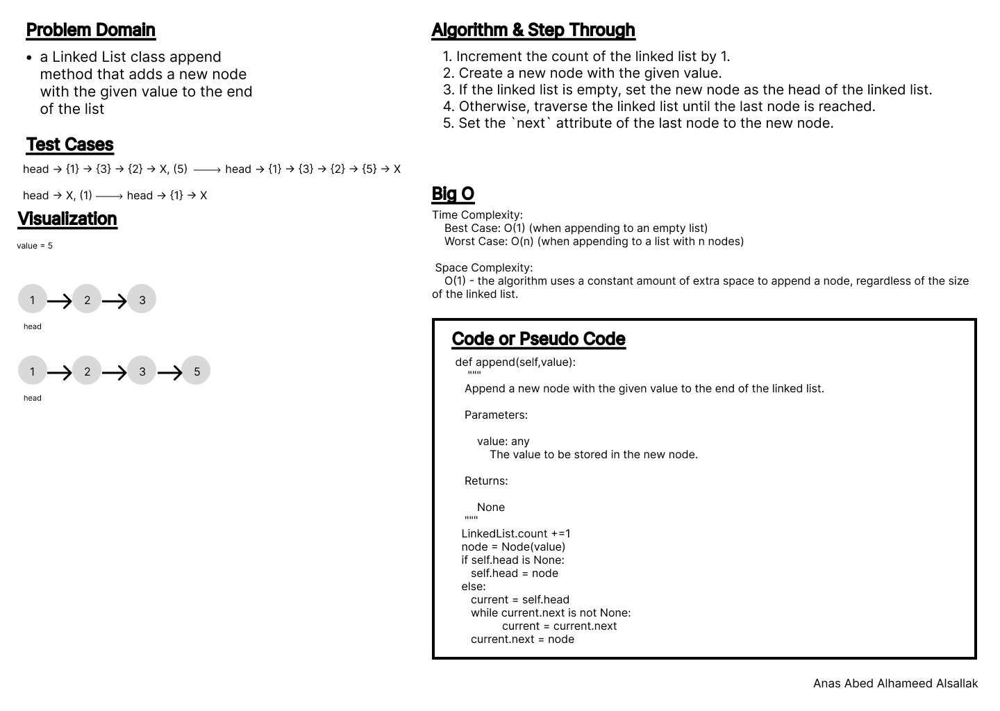
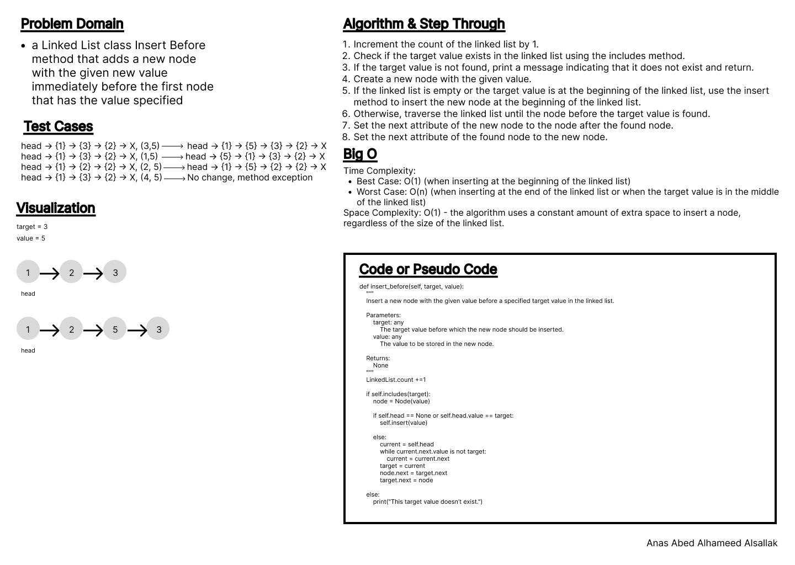
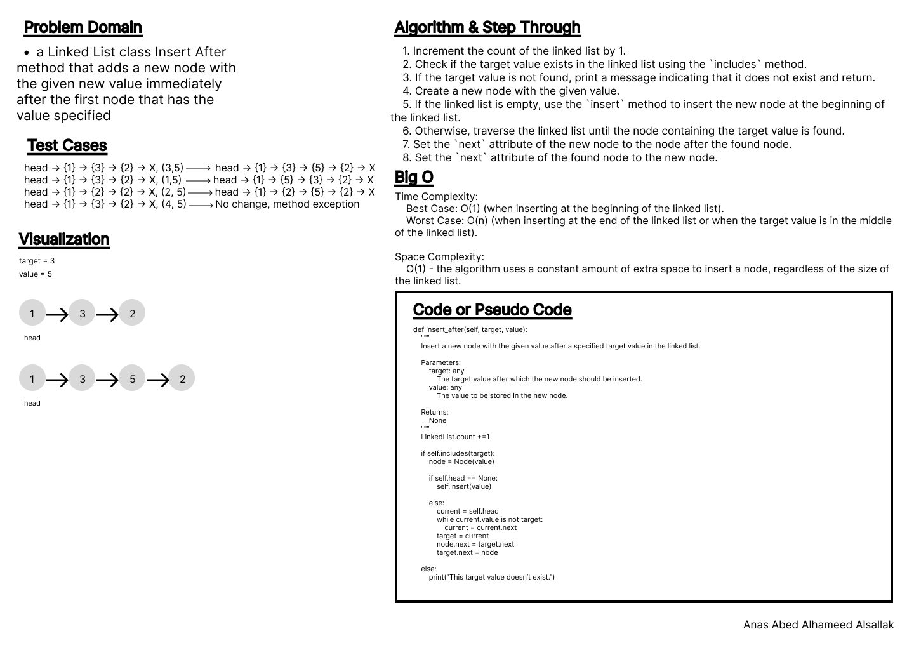
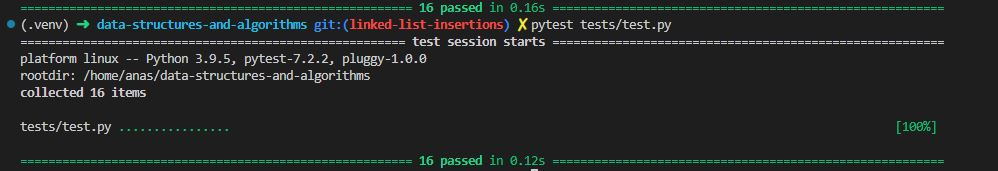

# Code Challenge: Class 06

Write out code as part of your whiteboard process.

Feature Tasks
Write the following methods for the Linked List class:

- append
  - arguments: new value
  - adds a new node with the given value to the end of the list
- insert before
  - arguments: value, new value
  - adds a new node with the given new value immediately before the first node that has the value specified
- insert after
  - arguments: value, new value
  - adds a new node with the given new value immediately after the first node that has the value specified

## Whiteboard Process

### append

### insert before

### insert after

## Approach & Efficiency

Loops, indexes, conditions, interpolation.

1

Time Complexity:
Best Case: O(1) (when appending to an empty list)
Worst Case: O(n) (when appending to a list with n nodes)

Space Complexity:
O(1) - the algorithm uses a constant amount of extra space to append a node, regardless of the size of the linked list.

2

Time Complexity:
Best Case: O(1) (when inserting at the beginning of the linked list)
Worst Case: O(n) (when inserting at the end of the linked list or when the target value is in the middle of the linked list)
Space Complexity: O(1) - the algorithm uses a constant amount of extra space to insert a node, regardless of the size of the linked list.

3

Time Complexity:
Best Case: O(1) (when inserting at the beginning of the linked list).
Worst Case: O(n) (when inserting at the end of the linked list or when the target value is in the middle of the linked list).

Space Complexity:
O(1) - the algorithm uses a constant amount of extra space to insert a node, regardless of the size of the linked list.

## Solution

[Code](../linkedListInsertions.py)

[Tests](../tests/test.py)

[Move to CC 07](../linked_list_kth/README.md) | [Previous](../linked_list/README.md)
