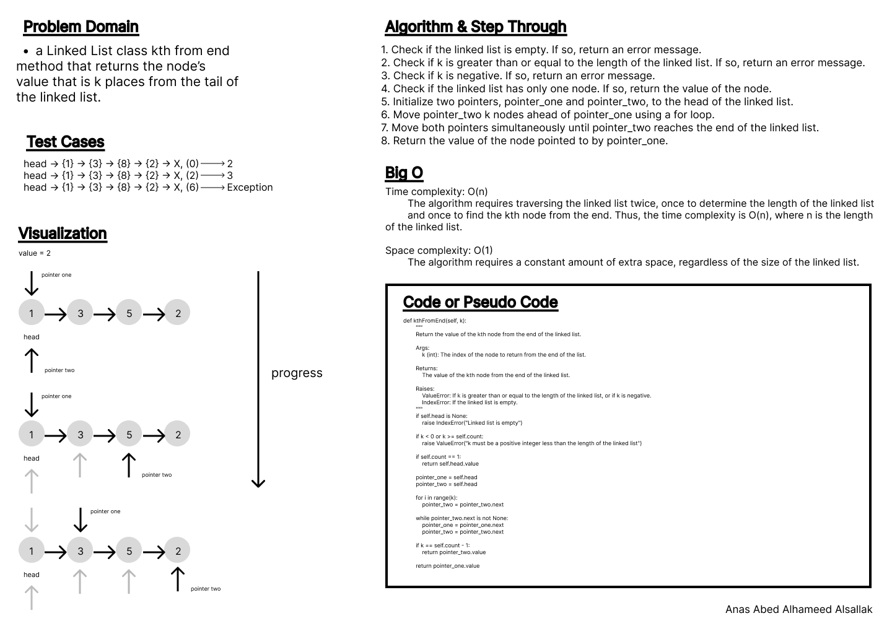
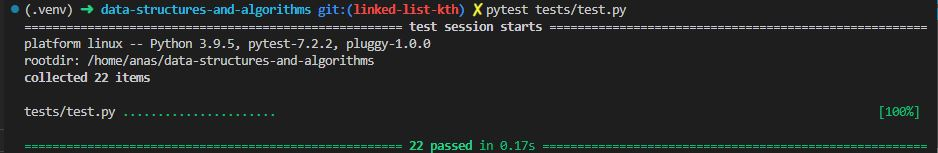

# Code Challenge: Class 07

Write out code as part of your whiteboard process.

**Feature Tasks**
Write the following method for the Linked List class:

    - kth from end
        - argument: a number, k, as a parameter.
        - Return the node’s value that is k places from the tail of the linked list.
        - You have access to the Node class and all the properties on the Linked List class as well as the -  methods created in previous challenges.

## Whiteboard Process

### kth from end

## Approach & Efficiency

Loops, indexes, conditions.

Time complexity: O(n) The algorithm requires traversing the linked list twice, once to determine the length of the linked list and once to find the kth node from the end. Thus, the time complexity is O(n), where n is the length of the linked list.

Space complexity: O(1) The algorithm requires a constant amount of extra space, regardless of the size of the linked list.

## Solution

[Code](../linkedListKth.py)

[Tests](../tests/test.py)

[Move to CC 08](../linked_list_zip/README.md) | [Previous](../linked_list_insertions/README.md)
