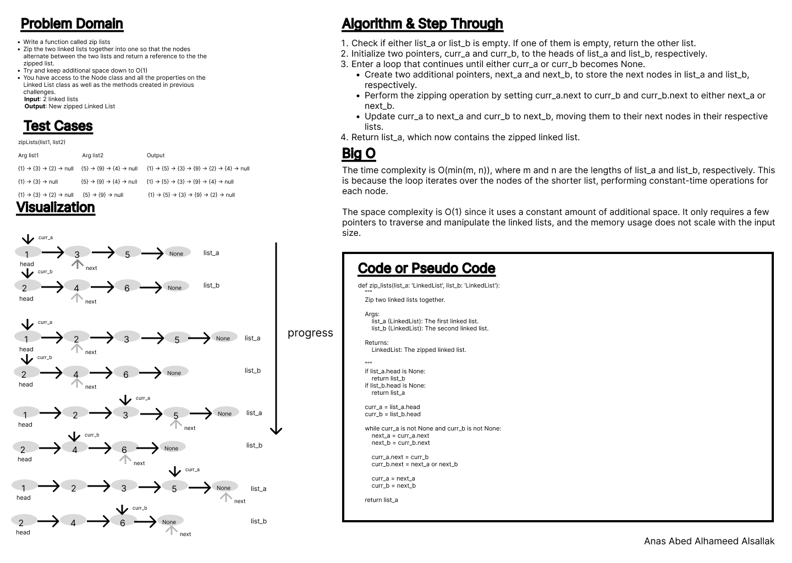
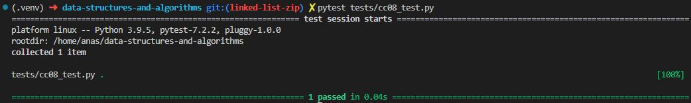

# Code Challenge: Class 08

Write out code as part of your whiteboard process.

## Feature Tasks

    - Write a function called zip lists
    - Arguments: 2 linked lists
    - Return: New Linked List, zipped as noted below
    - Zip the two linked lists together into one so that the nodes alternate between the two lists and return  a reference to the zipped list.
    - Try and keep additional space down to O(1)
    - You have access to the Node class and all the properties on the Linked List class as well as the methods created in previous challenges.

## Whiteboard Process

### linked list zip

## Approach & Efficiency

Loops, indexes, conditions, dot notation.

The time complexity is O(min(m, n)), where m and n are the lengths of list_a and list_b, respectively. This is because the loop iterates over the nodes of the shorter list, performing constant-time operations for each node.

The space complexity is O(1) since it uses a constant amount of additional space. It only requires a few pointers to traverse and manipulate the linked lists, and the memory usage does not scale with the input size.

## Solution

[Code](../linkedListZip.py)

[Tests](../tests/cc08_test.py)

[Move to CC 09](..//README.md) | [Previous](../linked_list_kth/README.md)
