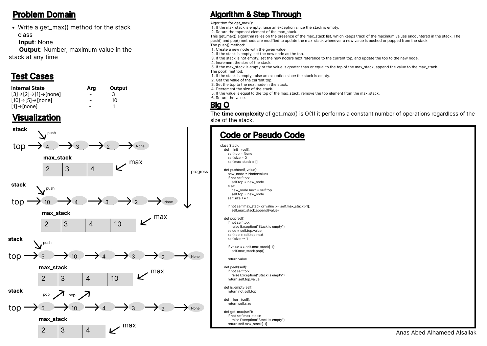
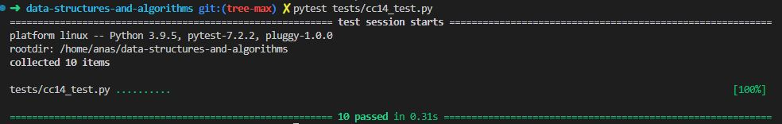

# Code Challenge: Class 15

Mock whiteboard interview.

## Feature Tasks

Write a get_max() method for the stack class the returns the maximum value in it at any given time.

## Whiteboard Process

.

## Approach & Efficiency

Conditionals, loops.

The time complexity of get_max() is O(1) it performs a constant number of operations regardless of the size of the stack.

## Solution

[Code](../stackGetMax.py)

[Tests](../tests/cc14_test.py)

[Move to CC 16](../tree_max/README.md) | [Previous](../stack-queue-brackets/README.md)
