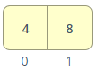
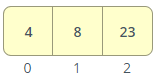
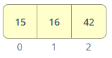
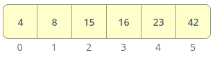

# Merge Sort

Merge Sort is a popular sorting algorithm that follows the divide-and-conquer approach. It works by repeatedly dividing the input list into smaller halves until each sublist contains only one element. Then, it merges the sorted sublists back together, comparing and combining the elements in a sorted order. This process continues until the entire list is sorted. Merge Sort is known for its efficient and stable sorting performance, with a time complexity of O(n log n).

## Pseudocode

```python
ALGORITHM Mergesort(arr)
    DECLARE n <-- arr.length

    if n > 1
      DECLARE mid <-- n/2
      DECLARE left <-- arr[0...mid]
      DECLARE right <-- arr[mid...n]
      // sort the left side
      Mergesort(left)
      // sort the right side
      Mergesort(right)
      // merge the sorted left and right sides together
      Merge(left, right, arr)

ALGORITHM Merge(left, right, arr)
    DECLARE i <-- 0
    DECLARE j <-- 0
    DECLARE k <-- 0

    while i < left.length && j < right.length
        if left[i] <= right[j]
            arr[k] <-- left[i]
            i <-- i + 1
        else
            arr[k] <-- right[j]
            j <-- j + 1

        k <-- k + 1

    if i = left.length
       set remaining entries in arr to remaining values in right
    else
       set remaining entries in arr to remaining values in left

```

## Trace

Sample Array: [8, 4, 23, 42, 16, 15]

### Pass 1

In Pass 1, we start with the original array of size 6. We divide it into two halves using the mid index (3), creating the left and right subarrays. The left subarray contains [8, 4, 23], and the right subarray contains [42, 16, 15].

- n = 6
- mid = 3
- left = [8, 4, 23]
- right = [42, 16, 15]

#### Pass 2-1 (left) [8, 4, 23]

In Pass 2-1, we focus on the left subarray [8, 4, 23]. We divide it into two halves using the mid index (1), creating the left and right subarrays. The left subarray contains [8], and the right subarray contains [4].

- n = 3
- mid = 15
- left = [8, 4]
- right = [23]

#### Pass 3-1 (left) [8, 4]

In Pass 3-1, we focus on the left subarray [8, 4]. Since the subarray size is 2, we further divide it into two halves using the mid index (0), creating the left and right subarrays. The left subarray contains [8], and the right subarray contains [4].

- n = 2
- mid = 1
- left = [8]
- right = [4]

#### Pass 4-1 (left) [8]

In Pass 4-1, we focus on the left subarray [8]. Since the subarray size is 1, we don't need to divide it further. We can directly move to the merging step.

- n = 4

##### Pass 4-2 (right) [4]

In Pass 4-2, we focus on the right subarray [4]. Since the subarray size is 1, we don't need to divide it further. We can directly move to the merging step. In this step, we compare the single elements in both the left and right subarrays and merge them in ascending order. The resulting sorted subarray is [4, 8].

- n = 1

|i|left[i]|j|right[j]|n|array[n]|
|-|-------|-|--------|-|--------|
|0|   8   |0|   4    |0|   8    |
| |       |1|        |1|   4    |

Arr: 

#### Pass 3-2 [23]

In Pass 3-2, we focus on the right subarray [23]. Since the subarray size is 1, we don't need to divide it further. We can directly move to the merging step. In this step, we compare the elements in the left subarray [4, 8] with the single element in the right subarray [23] and merge them in ascending order. The resulting sorted subarray is [4, 8, 23].

- n = 1

- left = [4, 8]
- right = [23]

|i|left[i]|j|right[j]|n|array[n]|
|-|-------|-|--------|-|--------|
|0|   4   |0|   23   |0|   4    |
|1|   8   | |        |1|   8    |
|2|       | |        |2|        |

Arr: 

### Pass 2-2 [42, 16, 15]

In Pass 2-2, we focus on the right subarray [42, 16, 15]. We divide it into two halves using the mid index (1), creating the left and right subarrays. The left subarray contains [42], and the right subarray contains [16, 15].

In this step, we compare the elements in the left subarray [4, 8, 23] with the elements in the right subarray [42, 16, 15] and merge them in ascending order. The resulting sorted subarray is [4, 8, 15, 16, 23, 42].

Like the above, it will return: 

- left = [4, 8, 23]
- right = [42, 16, 15]

|i|left[i]|j|right[j]|n|array[n]|
|-|-------|-|--------|-|--------|
|0|   4   |0|   15   |0|   4    |
|1|   8   | |        |1|   8    |
|2|   23  | |        |2|   15   |
| |       |1|   16   |3|   16   |
| |       |2|   42   |4|   23   |

Arr: 

## Efficency

1. time complexity: Merge Sort has a consistent efficiency of O(n log n), where 'n' represents the number of elements in the input list. This means that as the size of the input list grows, the time taken by Merge Sort increases at a rate that is proportional to n multiplied by the logarithm of n. This time complexity makes Merge Sort an efficient sorting algorithm for large datasets.

2. space complexity: Merge Sort has a requirement of additional space to perform the sorting operation. It typically requires an auxiliary array of the same size as the input list to temporarily store the sorted elements during the merging process. Therefore, the space complexity of Merge Sort is O(n), as it needs to allocate memory for the auxiliary array. This makes Merge Sort less memory efficient compared to some other sorting algorithms, particularly those with an in-place sorting nature. However, the additional space requirement of Merge Sort is considered reasonable and manageable in most scenarios.
