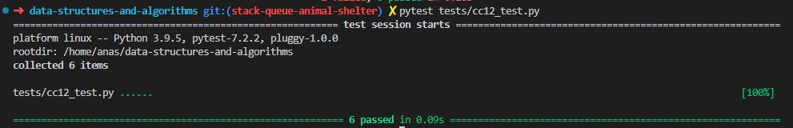

# Code Challenge: Class 12

Write out code as part of your whiteboard process.

## Feature Tasks

- Create a class called AnimalShelter which holds only dogs and cats.
- The shelter operates using a first-in, first-out approach.
- Implement the following methods:

        - enqueue
            - Arguments: animal
            - animal can be either a dog or a cat object.
            - It must have a species property that is either "cat" or "dog"
            - It must have a name property that is a string.
        - dequeue
            - Arguments: pref
            - pref can be either "dog" or "cat"
            - Return: either a dog or a cat, based on preference.
            - If pref is not "dog" or "cat" then return null.

## Stretch Goal

If a cat or dog isn’t preferred, return whichever animal has been waiting in the shelter the longest.

## Approach & Efficiency

Using of the stack class and its methods, conditionals, loops and exceptions.

The time complexity of the enqueue and dequeue operations in this implementation is O(n), where n is the number of elements in the PseudoQueue. This is because in the enqueue operation, we need to move all elements from stack1 to stack2 (n operations), and in the dequeue operation, we simply pop from stack1 (1 operation). The while loops for moving elements between the stacks contribute to the linear time complexity.

The space complexity of the PseudoQueue implementation is O(n), where n is the number of elements in the PseudoQueue. This is because we are using two Stack objects, stack1 and stack2, to simulate the queue behavior. The space required will grow linearly with the number of elements in the PseudoQueue.

## Solution

[Code](../stackQueueAnimalShelter.py)

[Tests](../tests/cc12_test.py)

[Move to CC 13](..//README.md) | [Previous](../stack_queue_pseudo/README.md)
