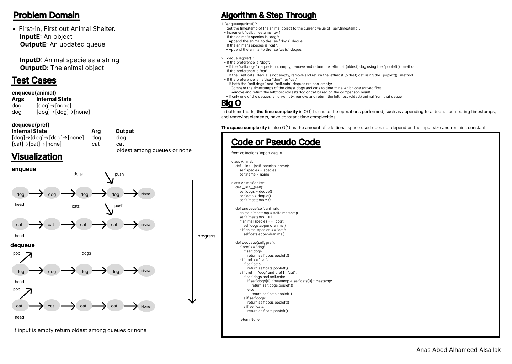

# Code Challenge: Class 12

Write out code as part of your whiteboard process.

## Feature Tasks

- Create a class called AnimalShelter which holds only dogs and cats.
- The shelter operates using a first-in, first-out approach.
- Implement the following methods:

        - enqueue
            - Arguments: animal
            - animal can be either a dog or a cat object.
            - It must have a species property that is either "cat" or "dog"
            - It must have a name property that is a string.
        - dequeue
            - Arguments: pref
            - pref can be either "dog" or "cat"
            - Return: either a dog or a cat, based on preference.
            - If pref is not "dog" or "cat" then return null.

## Stretch Goal

If a cat or dog isn’t preferred, return whichever animal has been waiting in the shelter the longest.

## Whiteboard Process

## Approach & Efficiency

Using of the deque class and its methods, conditionals, loops.

In both methods, the time complexity is O(1) because the operations performed, such as appending to a deque, comparing timestamps, and removing elements, have constant time complexities.

The space complexity is also O(1) as the amount of additional space used does not depend on the input size and remains constant.

## Solution

[Code](../stackQueueAnimalShelter.py)

[Tests](../tests/cc12_test.py)

[Move to CC 13](../stack-queue-brackets/README.md) | [Previous](../stack_queue_pseudo/README.md)
