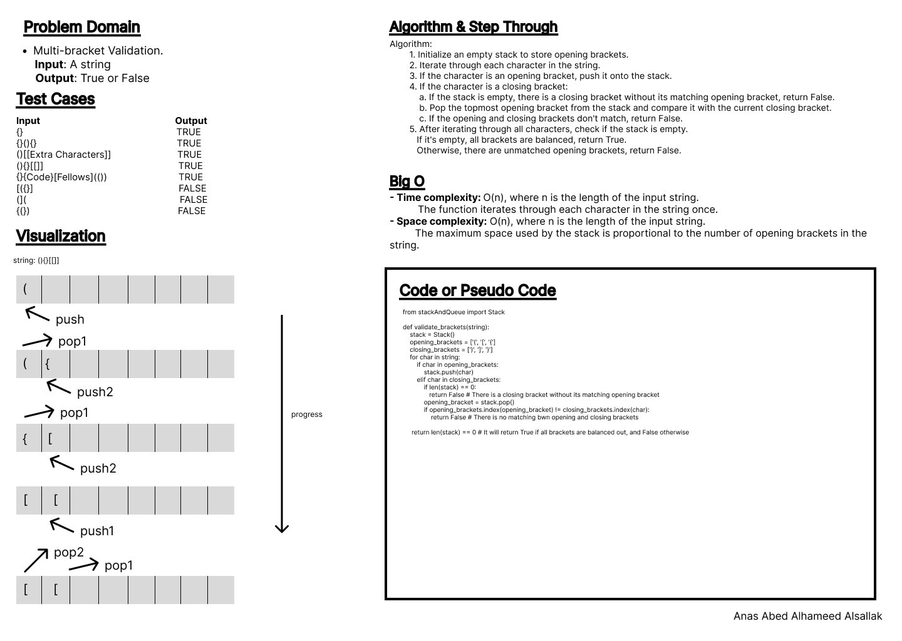
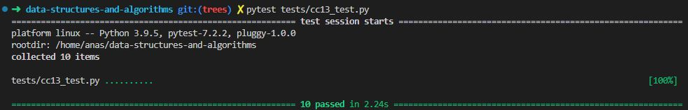

# Code Challenge: Class 13

Write out code as part of your whiteboard process.

## Feature Tasks

- Write a function called validate brackets
- Arguments: string
- Return: boolean
  - representing whether or not the brackets in the string are balanced
- There are 3 types of brackets:

  - Round Brackets : ()
  - Square Brackets : []
  - Curly Brackets : {}

## Whiteboard Process

## Approach & Efficiency

Using of stack class and its methods, conditionals, loops.

- Time complexity: O(n), where n is the length of the input string. The function iterates through each character in the string once.
- Space complexity: O(n), where n is the length of the input string.The maximum space used by the stack is proportional to the number of opening brackets in the string.

## Solution

[Code](../stackQueueBrackets.py)

[Tests](../tests/cc13_test.py)

[Move to CC 14](..//README.md) | [Previous](../stack-queue-animal-shelter/README.md)
