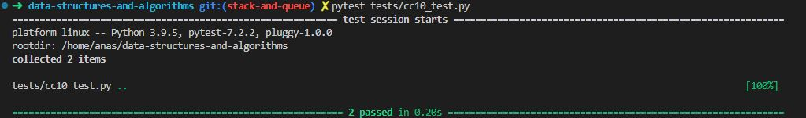

# Code Challenge: Class 10

Write out code as part of your whiteboard process.

## Feature Tasks

Using a Linked List as the underlying data storage mechanism, implement both a Stack and a Queue

Node

    - Create a Node class that has properties for the value stored in the Node, and a pointer to the next node.
Stack

    - Create a Stack class that has a top property. It creates an empty Stack when instantiated.
        - This object should be aware of a default empty value assigned to top when the stack is created.
        - The class should contain the following methods:
        - push
            - Arguments: value
            - adds a new node with that value to the top of the stack with an O(1) Time performance.
        - pop
            - Arguments: none
            - Returns: the value from node from the top of the stack
            - Removes the node from the top of the stack
            - Should raise exception when called on empty stack
        - peek
            - Arguments: none
            - Returns: Value of the node located at the top of the stack
            - Should raise exception when called on empty stack
        - is empty
            - Arguments: none
            - Returns: Boolean indicating whether or not the stack is empty.
Queue

    - Create a Queue class that has a front property. It creates an empty Queue when instantiated.
        - This object should be aware of a default empty value assigned to front when the queue is created.
        - The class should contain the following methods:
        - enqueue
            - Arguments: value
            - adds a new node with that value to the back of the queue with an O(1) Time performance.
        - dequeue
            - Arguments: none
            - Returns: the value from node from the front of the queue
            - Removes the node from the front of the queue
            -Should raise exception when called on empty queue
        - peek
            - Arguments: none
            - Returns: Value of the node located at the front of the queue
            - Should raise exception when called on empty stack
        - is empty
            - Arguments: none
            - Returns: Boolean indicating whether the queue is empty
You have access to the Node class and all the properties on the Linked List class.

## Approach & Efficiency

**Stack:**

    - Using a singly linked list as the underlying data structure can provide an efficient implementation for the Stack class.
    - Time complexity:
        - Push operation: O(1) - Since the new element is added to the top of the stack, it can be done in constant time.
        - Pop operation: O(1) - Removing the top element of the stack can also be done in constant time.
        - Peek operation: O(1) - Accessing the top element without removing it is a constant-time operation.
        - Is empty operation: O(1) - Checking if the stack is empty can be done in constant time.
    - Space complexity:
        The space complexity for a stack implemented using a linked list is O(n), where n is the number of elements in the stack.
**Queue:**

    - Similarly, a singly linked list can be used as the underlying data structure for implementing the Queue class.
    - Time complexity:
        - Enqueue operation: O(1) - Adding an element to the back of the queue can be done in constant time.
        - Dequeue operation: O(1) - Removing the front element of the queue can also be done in constant time.
        - Peek operation: O(1) - Accessing the front element without removing it is a constant-time operation.
        - Is empty operation: O(1) - Checking if the queue is empty can be done in constant time.
    - Space complexity:
        - The space complexity for a queue implemented using a linked list is O(n), where n is the number of elements in the queue.

## Solution

[Code](../stackAndQueue.py)

[Tests](../tests/cc10_test.py)

[Move to CC 11](..//README.md) | [Previous](../linked_list_zip/README.md)
