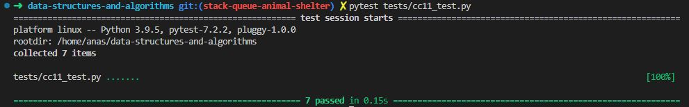

# Code Challenge: Class 11

Write out code as part of your whiteboard process.

## Feature Tasks

Create a new class called pseudo queue.
    - Do not use an existing Queue.
    - Instead, this PseudoQueue class will implement our standard queue interface (the two methods listed below),
    - Internally, utilize 2 Stack instances to create and manage the queue
Methods:
    - enqueue
        - Arguments: value
        - Inserts a value into the PseudoQueue, using a first-in, first-out approach.
    - dequeue
        - Arguments: none
        - Extracts a value from the PseudoQueue, using a first-in, first-out approach.
**NOTE:** The Stack instances have only push, pop, and peek methods. You should use your own Stack implementation. Instantiate these Stack objects in your PseudoQueue constructor.

## Approach & Efficiency

**Stack:**

    - Using a singly linked list as the underlying data structure can provide an efficient implementation for the Stack class.
    - Time complexity:
        - Push operation: O(1) - Since the new element is added to the top of the stack, it can be done in constant time.
        - Pop operation: O(1) - Removing the top element of the stack can also be done in constant time.
        - Peek operation: O(1) - Accessing the top element without removing it is a constant-time operation.
        - Is empty operation: O(1) - Checking if the stack is empty can be done in constant time.
    - Space complexity:
        The space complexity for a stack implemented using a linked list is O(n), where n is the number of elements in the stack.
**Queue:**

    - Similarly, a singly linked list can be used as the underlying data structure for implementing the Queue class.
    - Time complexity:
        - Enqueue operation: O(1) - Adding an element to the back of the queue can be done in constant time.
        - Dequeue operation: O(1) - Removing the front element of the queue can also be done in constant time.
        - Peek operation: O(1) - Accessing the front element without removing it is a constant-time operation.
        - Is empty operation: O(1) - Checking if the queue is empty can be done in constant time.
    - Space complexity:
        - The space complexity for a queue implemented using a linked list is O(n), where n is the number of elements in the queue.

## Solution

[Code](../stackQueuePseudo.py)

[Tests](../tests/cc11_test.py)

[Move to CC 12](..//README.md) | [Previous](../stack_and_queue/README.md)
