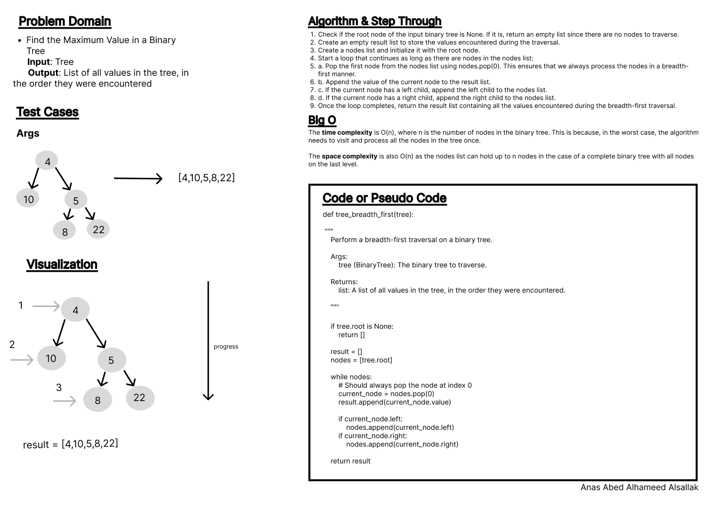
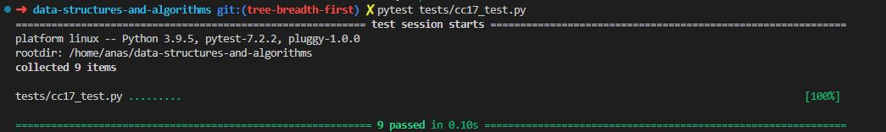

# Code Challenge: Class 17

Write out code as part of your whiteboard process.

## Feature Tasks

Write a function called breadth first

        - Arguments: tree
        - Return: list of all values in the tree, in the order they were encountered

> NOTE: Traverse the input tree using a Breadth-first approach

## Whiteboard Process

## Approach & Efficiency

Using of tree class and its methods, conditionals, loops.

- The time complexity of the tree_breadth_first algorithm is O(n), where n is the number of nodes in the binary tree. This is because, in the worst case, the algorithm needs to visit and process all the nodes in the tree once.
- The space complexity is also O(n) as the nodes list can hold up to n nodes in the case of a complete binary tree with all nodes on the last level.

## Solution

[Code](../treeBreadthFirst.py)

[Tests](../tests/cc17_test.py)

[Move to CC 18](..//README.md) | [Previous](../tree_max/README.md)
