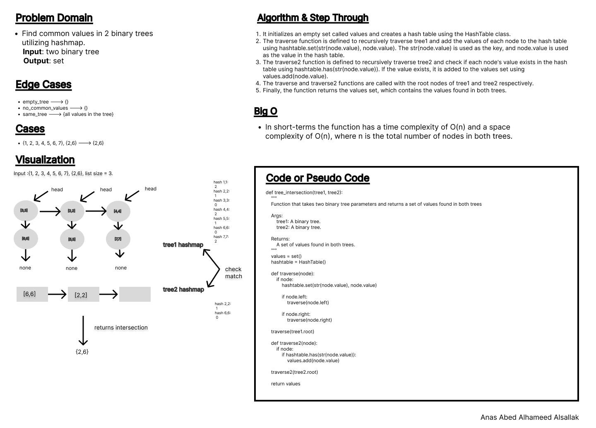

# Code Challenge 32

Write a function called tree_intersection that takes two binary trees as parameters.
Using your Hashmap implementation as a part of your algorithm, return a set of values found in both trees.

## Whiteboard Process

## Approach & Efficiency

Classes, methods, loops, conditionals.

Time complexity: O(n) where n is the number of words in the book.
Space complexity: O(m) where m is the number of unique words in the book.

## Solution

[code](./tree_intersection/tree_intersection.py)

[test](./tree_intersection/cc32_test.py)
