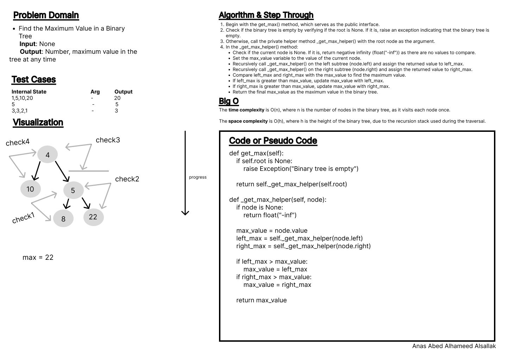
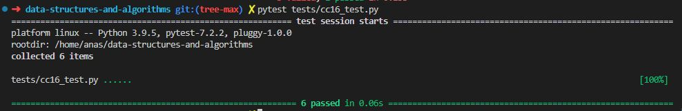

# Code Challenge: Class 16

Write out code as part of your whiteboard process.

## Feature Tasks

Write the following method for the Binary Tree class

    - find maximum value
    - Arguments: none
    - Returns: number

## Whiteboard Process

## Approach & Efficiency

Using of stack class and its methods, conditionals, recursion.

- The time complexity is O(n), where n is the number of nodes in the binary tree, as it visits each node once.

- The space complexity is O(h), where h is the height of the binary tree, due to the recursion stack used during the traversal.

## Solution

[Code](../treeMax.py)

[Tests](../tests/cc16_test.py)

[Move to CC 17](..//README.md) | [Previous](../tree/README.md)
