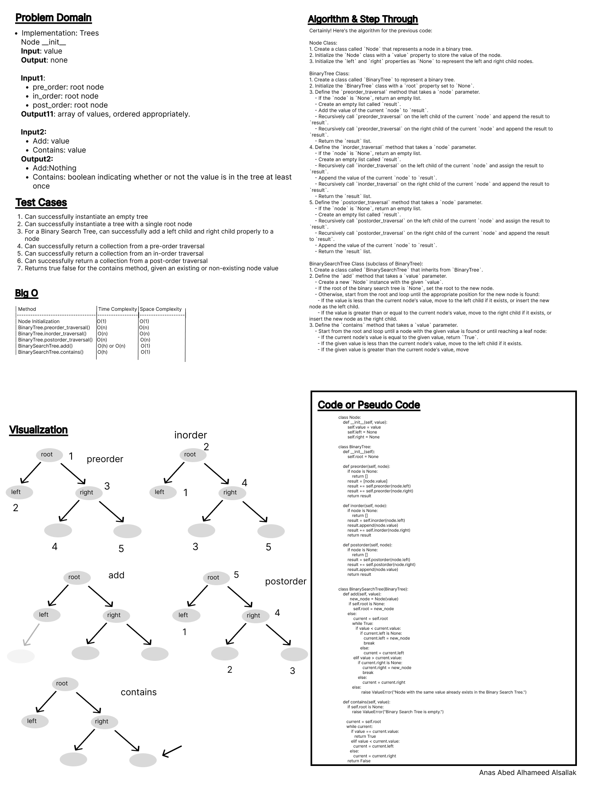
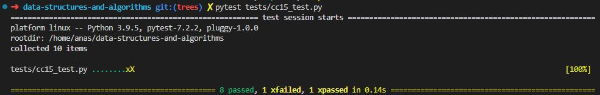

# Code Challenge: Class 15

Write out code as part of your whiteboard process.

## Feature Tasks

- Features
- Node
    -Create a Node class that has properties for the value stored in the node, the left child node, and the right child node.
- Binary Tree
        - Create a Binary Tree class
            - Define a method for each of the depth first traversals:
                - pre order
                - in order
                - post order
        - Each depth first traversal method should return an array of values, ordered appropriately.
- Binary Search Tree
        - Create a Binary Search Tree class
            - This class should be a sub-class (or your languages equivalent) of the Binary Tree Class, with the following additional methods:
            - Add
                - Arguments: value
                - Return: nothing
                - Adds a new node with that value in the correct location in the binary search tree.
            - Contains
                - Argument: value
                - Returns: boolean  indicating whether or not the value is in the tree at least once.

## Stretch Goal

Create a new branch called k-ary-tree, and, using the resources available to you online, implement a k-ary tree, where each node can have any number of children.

## Whiteboard Process

.

## Approach & Efficiency

Using of the classs and its methods, conditionals, loops.

Here's the list of the time and space complexity for the methods in the provided code:

Node Class:
    - Initialization: O(1)

BinaryTree Class:
    - `preorder_traversal`:
      - Time Complexity: O(n) - where n is the number of nodes in the binary tree, as we need to visit each node once.
      - Space Complexity: O(n) - the space required for the recursion stack in the worst case, as the depth of the recursion can be equal to the number of nodes in the tree.
    - `inorder_traversal`:
      - Time Complexity: O(n)
      - Space Complexity: O(n)
    - `postorder_traversal`:
      - Time Complexity: O(n)
      - Space Complexity: O(n)

    BinarySearchTree Class (subclass of BinaryTree):
    - `add`:
      - Time Complexity: O(h) - where h is the height of the binary search tree. In the worst case, the tree can be unbalanced, resulting in a time complexity of O(n), where n is the number of nodes in the tree.
      - Space Complexity: O(1)
    - `contains`:
      - Time Complexity: O(h)
      - Space Complexity: O(1)

The time complexity for the methods in BinaryTree and BinarySearchTree is primarily dependent on the number of nodes in the tree and the height of the tree. The space complexity is determined by the recursion stack or the constant space used.

The space complexity for the traversal methods is O(n) due to the recursion stack, and the space complexity for other methods is O(1) as they use constant space.

Note that the worst-case time complexity for `add()` and `contains()` in a binary search tree is O(n) if the tree is highly unbalanced. However, on average, a balanced binary search tree has a height of O(log n), resulting in an average time complexity of O(log n) for these methods.

## Solution

[Code](../trees.py)

[Tests](../tests/cc15_test.py)

[Move to CC 16](..//README.md) | [Previous](..//README.md)
